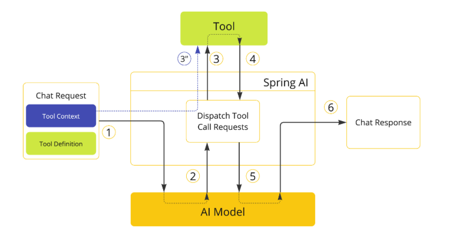
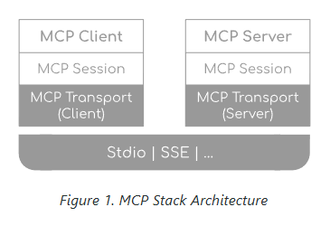
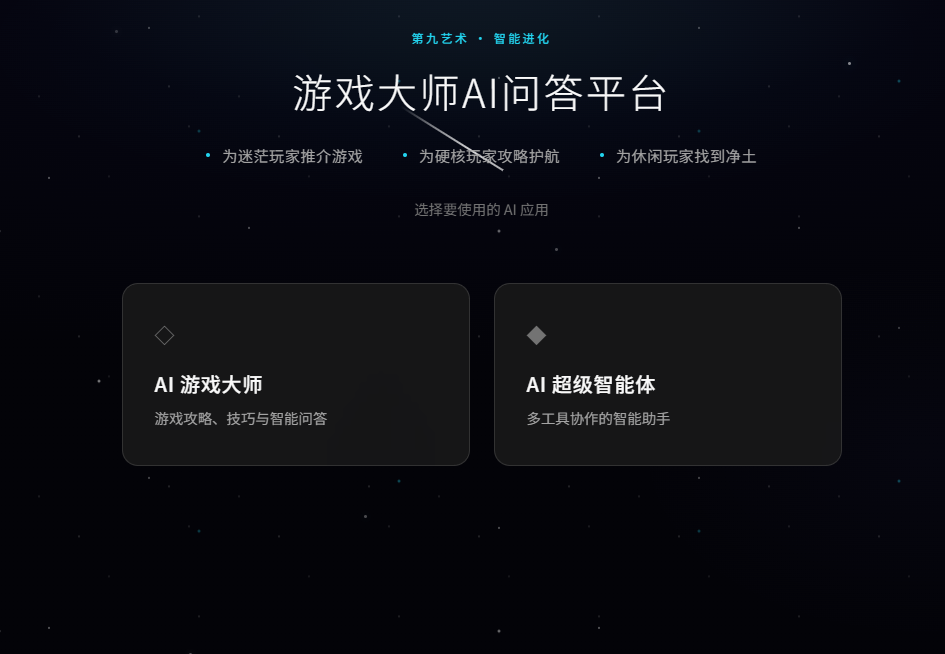
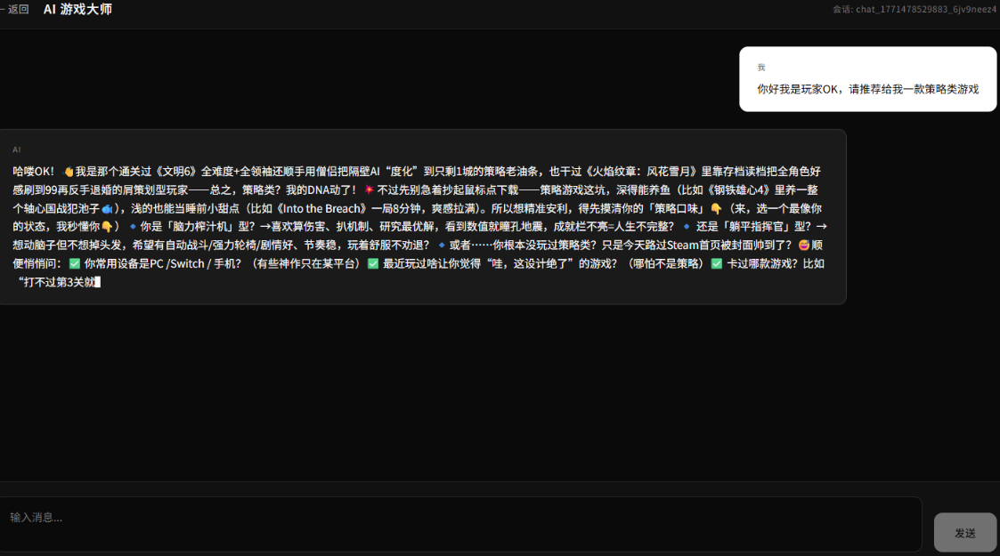

# 游戏咨询AI智能体

## 技术栈
* Spring AI
* 通义大模型
* Rag
* PgVectorStore数据库
* MCP外部工具调用
* OpenManus 智能体


## QuickStart
* 通过以下代码将本项目部署到本地
```bash
git clone https://github.com/1739593263/AI-Agent-GameApp.git
```
* 运行 src/main/java/com/springai/polymodalaiagent/PolyModalAiAgentApplication.java 文件以启动后端。
* 进入 agent-ai-frontend，安装npm并运行项目。
```bash
 npm install
 
 npm run dev
```

## Rag库
将Query和Rag库内容转化成VectorStore数据用于计算相似度并排序。在调用大模型时，
通过**QuestionAnswerAdvisor**或者**RetrievalAugmentationAdvisor**来请求Rag流。
其中QuestionAnswerAdvisor用于**包装Query相似的上下文到prompt中**，而RetrievalAugmentationAdvisor在整合rag中相似的上下文时还能更灵活的定义rag流。

本项目中有三种Rag库
1. 本地文件转VectorStore (AppVectorStoreConfig.java)
    * 加载markdown文件
    * 文本分割(MyTokenTextSplitter.java)+关键词增强(MyKeywordEnricher.java:从文本中抓取关键词并添加到metadata中)
    * 将处理完成的文件list转化成vectorstore。
2. 云知识库转VectorStore (AppCloudAdvisorConfig.java)
    * 直接上传文本文件到云知识库。
    * 在云知识库中配置分割方式和metadata。
    * 后端通过 RetrievalAugmentationAdvisor 直接调用知识库自动获取VectorStore支持
3. PgVectrStore 数据库 (PgVectorVectorsStoreConfig.java)
    * 将文件提前以VectorStore对象的形式持久存在Postgre Sql Database里面。
    * 后端调用直接计算相似度获取目标上下文内容。


## Tools
Spring AI 中 Tools类用于帮助AI大模型更好的生成合理的答案。大模型会根据自己所需调用后端的Tool函数。而后端会运行该函数并将结果返回给大模型继续执行。


1. ChatClient通过申明**ToolCallBack**封装好的被@Tool标签包装后的Java函数来定义模型Tools。这一步中，后端会包装一个ToolDefinition和相关的Metadata给大模型
   1. 这里用来**JsonSchemaGenerator**将@Tool方法解析生成一个JsonSchema存入ToolDefinition，后AI Model通过检测这些schema来判断需要使用的Tool。
2. 大模型运行过程中调用相关Tool。
3. 找到Tool方法； 3` 是在第一步前后端通过定义Context以Map的形式直接传给相关Tool参数的步骤，此类参数不需要AI Model传输，使信息更加安全并且结果更准确。
4. 后端通过 **ToolCallResultConvert** 将函数返回值统一包装成 String 返回给分配到的 AI Model。
5. 继续执行
6. 完成Response输出。


## MCP
本质和Tool一样，不同的点是MCP提供的Tool是外部写好的，后端需要做的是扮演一个MCPClient去申请调用MCPServer中的Tools。
而MCP则是维护这种Client和Server沟通连接一致性的协议，保证Server提供的接口能够被各种大模型调用。


* MCP网络结构
  * Client/Server: 管理Client和Server端各自的协议。
  * Session：用于创建以及维护会话连接用于沟通
  * Transport：序列以及反序列化JSON-RPC信息，支撑Stdio，SSE，等传输实现。
    * Studio：用于Server和Client在一个主机端口下的交流传输（本地调用）。
    * SSE：用于Server和Client在不同服务器的情况下的交流传输（远程调用）。


## 网页演示




